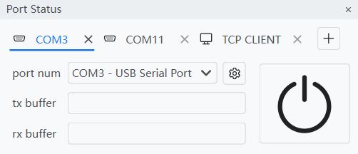

<h1 align="center">
    UniComm
</h1>

<p align="center">
    A universal communication debugging tool for multiple protocols
</p>

<div align="center">

[](https://github.com/zyt20001205/UniComm/releases)

</div>

## Features

### Multiple Port Control

<div align="center">



</div>

### Visual Script Coding

<div align="center">


</div>

### Port Data Processing

<div align="center">


<br>


</div>

## For Users

### Install

Download the latest release from [Releases](https://github.com/zyt20001205/UniComm/releases) page.

### Quickstart

## For Developers

### Requirements

- `Nuitka`                    2.7.5
- `PySide6`                   6.9.0
- `pyqtdarktheme`             2.1.0
- `pyqtgraph`                 0.13.7
- `requests`                  2.32.3

### Pack Command

```shell
nuitka --standalone --enable-plugin=pyside6 --windows-console-mode=disable --include-data-dir=icon=icon --include-data-dir=translation=translation --output-dir=dist main.py
```

### Localization

Generate .ts file:

```shell
pyside6-lupdate data_module.py document_module.py gui_module.py io_module.py log_module.py setting_module.py -ts translation/zh_CN.ts
```

Do translation:

```shell
pyside6-linguist translation/zh_CN.ts
```

Generate .qm file:

```shell
pyside6-lrelease translation/zh_CN.ts -qm translation/zh_CN.qm
```
