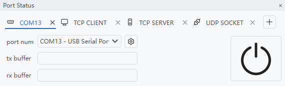

<h1 align="center">
    UniComm
</h1>

<p align="center">
    A programmable communication debugging tool for multiple protocols
</p>

<div align="center">

[](https://github.com/zyt20001205/UniComm/releases)
[](https://pypi.org/project/PySide6/)
[](https://opensource.org/licenses/MIT)
[]()

</div>

## Features

### Multiple Port/Protocol Support

<div align="center">



</div>

### Visual Script Coding & Saving

<div align="center">


</div>

### Port Data Collecting & Processing

<div align="center">


</div>

## For Users

### Install

Download the latest release from [Releases](https://github.com/zyt20001205/UniComm/releases) page.

### Sending & Saving First Command

<div align="center">


</div>

## For Developers

### Requirements

- `Nuitka`                    2.7.5
- `PySide6`                   6.9.0
- `pyqtdarktheme`             2.1.0
- `pyqtgraph`                 0.13.7
- `requests`                  2.32.3

### Pack Command

```shell
nuitka --standalone --enable-plugin=pyside6 --windows-console-mode=disable --include-data-dir=icon=icon --include-data-dir=translation=translation --include-data-file=LICENSE=LICENSE --output-dir=dist src/main.py
```

### Localization

Generate .ts file:

```shell
pyside6-lupdate src/data_module.py src/document_module.py src/gui_module.py src/io_module.py src/log_module.py src/setting_module.py -ts translation/zh_CN.ts
```

Do translation:

```shell
pyside6-linguist translation/zh_CN.ts
```

Generate .qm file:

```shell
pyside6-lrelease translation/zh_CN.ts -qm translation/zh_CN.qm
```
